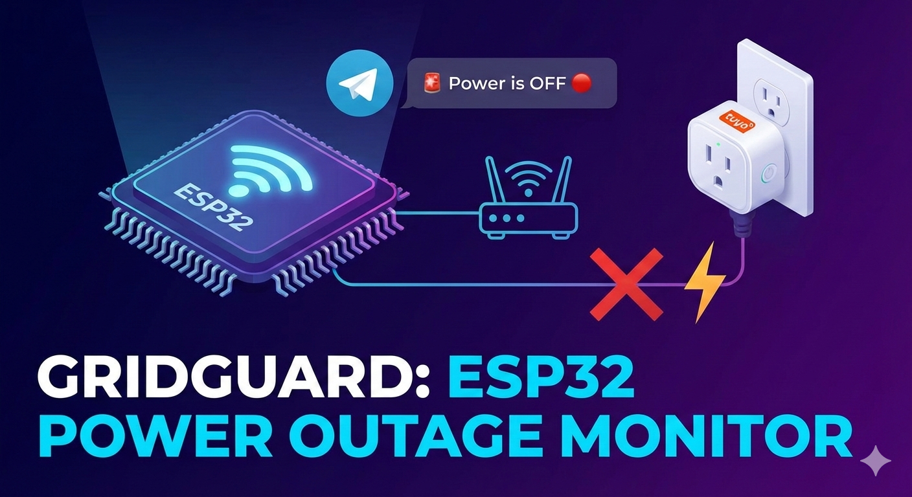

# ⚡ GridGuard: ESP32 Power Outage Monitor

**GridGuard** is a lightweight, reliable solution for monitoring power outages in specific areas (like a city power line) using an ESP32 and a standard smart socket. It notifies you via **Telegram** when the power goes out or returns, calculating the exact duration of the outage.




---

## 🛠 Project Logic & Scheme

The system operates on a "Watchdog" principle:
1.  **The Smart Socket:** Plugged into the power line you want to monitor (the one that experiences outages). Its Wi-Fi module starts up as soon as it receives power.
2.  **The ESP32:** Stays powered by an Uninterruptible Power Supply (UPS) or a "stable" line.
3.  **Connectivity:** The ESP32 pings the smart socket's IP address every few seconds.
    * **Ping Success:** The monitored line is ON.
    * **Ping Failure:** The monitored line is OFF.


---

## 📋 Prerequisites

* **ESP32-WROOM** Development Board.
* **Tuya Wi-Fi Smart Socket** (or any Wi-Fi device that responds to ping).
* **A Router** where you can set a Static IP for the socket.
* **Telegram Bot** (for notifications).

---

## 🚀 Setup Instructions

### 1. Smart Socket Configuration
* Plug the socket into the monitored line.
* Connect it to your Wi-Fi.
* **Crucial:** Go to your router settings, find the socket, and **assign a static IP address** (e.g., `192.168.1.50`). This ensures the ESP32 always knows where to look for it.
* *Note: You don't need to turn the relay on; the Wi-Fi chip pings regardless.*

### 2. Creating the Telegram Bot
1.  Message [@BotFather](https://t.me/botfather) on Telegram and send `/newbot`.
2.  Save the **API Token** provided.
3.  Add your bot to a group or chat.
4.  Get your **Chat ID** (use [@userinfobot](https://t.me/userinfobot) or similar).
5.  If using group topics, find your **Thread ID**.

### 3. Flashing the ESP32
1.  Open **Arduino IDE**.
2.  Install the **ESPping** library (by pbecchi).
3.  Insert your credentials into the code:
    * `ssid` / `password`
    * `target` (The Socket's static IP)
    * `botToken` / `chatId`

---

## 💻 The Code

The code features **EEPROM persistence** using the `Preferences` library. This prevents the bot from sending duplicate "Power Off" messages if the ESP32 itself restarts during a blackout.

```cpp
#include <WiFi.h>
#include <HTTPClient.h>
#include <ESPping.h>
#include <Preferences.h>
#include "time.h"

// --- CONFIGURATION ---
const char* ssid = "YOUR_WIFI_SSID"; 
const char* password = "YOUR_WIFI_PASSWORD"; 
const char* target = "192.168.1.XX"; // Static IP of your Smart Socket

const String botToken = "YOUR_BOT_TOKEN";
const String chatId = "-100XXXXXXXXX";  
const int threadId = 0; // Set your Thread ID if using Telegram Topics

// Timezone for Ukraine (handles Summer/Winter time automatically)
const char* TZ_INFO = "EET-2EEST,M3.5.0/3,M10.5.0/4";

// --- VARIABLES ---
Preferences preferences;
time_t lastEventTime; 
bool isPingFailed; 

int pFailCount = 0;
int pSuccessCount = 0;
const int pThreshold = 5; // Number of checks before confirming state change

void setup() {
  Serial.begin(9600);
  WiFi.begin(ssid, password);
  
  Serial.print("Connecting to WiFi");
  while (WiFi.status() != WL_CONNECTED) { 
    delay(500); 
    Serial.print(".");
  }
  Serial.println(" Connected!");

  // Sync time with NTP
  configTzTime(TZ_INFO, "pool.ntp.org", "ua.pool.ntp.org");

  struct tm timeinfo;
  while(!getLocalTime(&timeinfo)){
    Serial.println("Waiting for NTP time...");
    delay(1000);
  }

  // Open non-volatile storage
  preferences.begin("monitor", false);
  
  isPingFailed = preferences.getBool("state", false); 
  lastEventTime = preferences.getLong("lastTime", 0);
  
  if (lastEventTime == 0) {
    time(&lastEventTime);
    preferences.putLong("lastTime", (long)lastEventTime);
  }

  Serial.println("System Ready. Last state: " + String(isPingFailed ? "No Power" : "Power OK"));
}

void loop() {
  bool currentPing = Ping.ping(target);
  time_t now;
  time(&now);

  if (currentPing) {
    pFailCount = 0;
    pSuccessCount++;
    // Power restored: Ping was failed, now 5 successful pings
    if (pSuccessCount >= pThreshold && isPingFailed) {
      String msg = "Power is BACK 🟢\n⏰ Outage duration: " + formatDuration(lastEventTime, now);
      sendTelegramMessage(msg);
      updateStorage(false, now);
    }
  } else {
    pSuccessCount = 0;
    pFailCount++;
    // Power lost: Ping was OK, now 5 failed pings
    if (pFailCount >= pThreshold && !isPingFailed) {
      String msg = "Power is OFF 🔴\n⏰ Lasted for: " + formatDuration(lastEventTime, now);
      sendTelegramMessage(msg);
      updateStorage(true, now);
    }
  }
  delay(3000); // Check every 3 seconds
}

void updateStorage(bool failed, time_t t) {
  isPingFailed = failed;
  lastEventTime = t;
  preferences.putBool("state", failed);
  preferences.putLong("lastTime", (long)t);
  Serial.println("State saved to Flash");
}

String formatDuration(time_t start, time_t end) {
  long diff = (long)difftime(end, start);
  if (diff < 60) return "less than a minute";
  
  long h = diff / 3600;
  long m = (diff % 3600) / 60;
  
  String res = "";
  if (h > 0) res += String(h) + " hours ";
  if (m > 0) res += String(m) + " minutes";
  return res;
}

void sendTelegramMessage(String message) {
  if (WiFi.status() == WL_CONNECTED) {
    HTTPClient http;
    String url = "https://api.telegram.org/bot" + botToken + "/sendMessage?chat_id=" + chatId + "&text=" + urlEncode(message) + "&message_thread_id=" + String(threadId);
    http.begin(url);
    int code = http.GET();
    Serial.println("Telegram code: " + String(code));
    http.end();
  }
}

String urlEncode(String str) {
  String encodedString = "";
  for (int i = 0; i < str.length(); i++) {
    char c = str.charAt(i);
    if (isalnum(c)) encodedString += c;
    else {
      char buf[4];
      sprintf(buf, "%%%02X", c);
      encodedString += buf;
    }
  }
  return encodedString;
} 
```

## ✨ Key Features
1. Non-Volatile Memory: Uses ESP32 Preferences to store state. If the ESP32 reboots, it won't send a false "Power OFF" alert.
2. Smart Timezones: Automatically handles Ukraine's Daylight Saving Time (DST).
3. Anti-Flicker Logic: Ignores momentary network drops by requiring 5 consecutive failed pings before triggering an alert.
4. Duration Tracking: Clearly states how long the power was missing.
